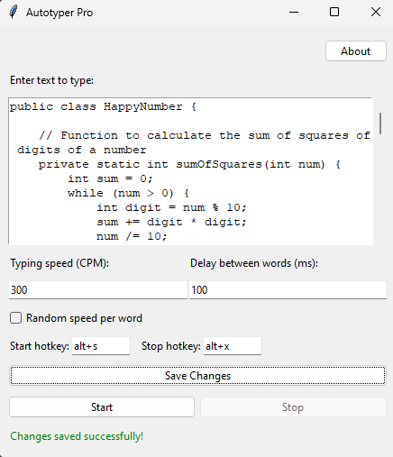

# Autotyper Pro 🤖✨

AutoTyper Pro is a powerful and user-friendly tool that automates typing tasks on your computer. Customize it to repeatedly input text or generate realistic typing patterns, saving you time and enhancing productivity. Best of all, it's completely free to use!

## Features ✨

- **Customizable Typing Speed**: Set the characters per minute (CPM) to adjust the typing speed to your preference.
- **Delay Between Words**: Control the delay between words to create a more natural typing rhythm.
- **Random Speed Variation**: Enable a "human-like" mode that introduces random speed variations for each word, making the typing appear more natural.
- **Multi-line Text Input**: Type and automate long passages of text, not just single lines.
- **Hotkey Controls**: Start and stop the typing process using customizable global hotkeys (e.g., Alt+S, Alt+X).
- **Easy-to-Use Interface**: The clean and intuitive graphical user interface makes the Autotyper simple to operate.

## Download Autotyper Pro 📥

You can download the latest version of Autotyper Pro from the following link:

[Download Autotyper Pro](https://github.com/srijanpathak03/Autotyper/releases/download/v1.0/AutoTyperSetup.exe)

## Installation 🏠

1. Download the `AutoTyperSetup.exe` file from the [latest release](https://github.com/srijan-pathak/autotyper/releases/latest).
2. Run the installer file and follow the on-screen instructions to install the Autotyper on your Windows computer.
3. Once installed, you can launch the Autotyper from the Start menu or by double-clicking the desktop shortcut (if you chose to create one during installation).

## Usage 🖥️

1. Open the Autotyper application.
2. Enter the text you want to type automatically in the text input area.
3. Adjust the typing speed and delay between words to your liking.
4. Enable the "Random speed per word" option if you want a more natural, human-like typing effect.
5. Set your preferred hotkeys for starting and stopping the typing process.
6. Click the "Start" button or use the "Start" hotkey to begin the automated typing.
7. To stop the typing, click the "Stop" button or use the "Stop" hotkey.

## Contributing 🤝

If you have any suggestions, bug reports, or would like to contribute to the development of the Autotyper, please feel free to open an issue or submit a pull request on the [GitHub repository](https://github.com/srijanpathak03/Autotyper).

